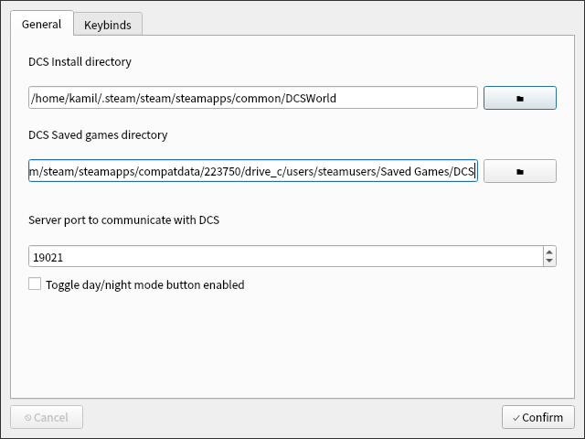
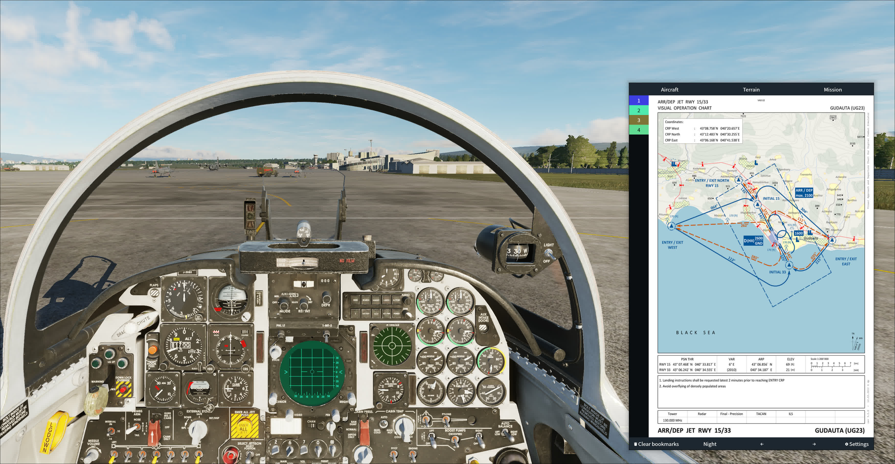
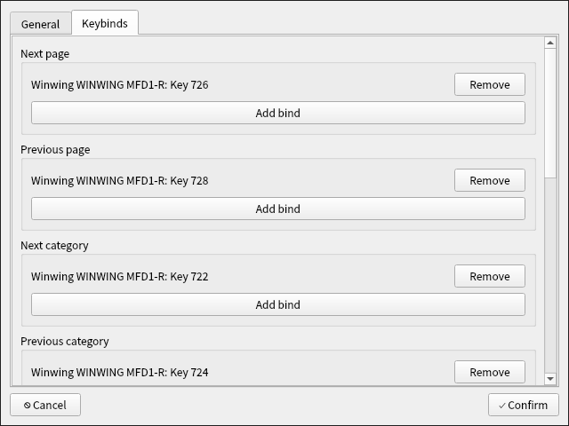

# Tuxpit-kneeboard
Tuxpit kneeboard is an overlay application to display kneeboard pages from Digital Combat Simulator exclusively on Linux. This is especially useful when you have a multi monitor setup. DCS will by default always show the in game kneeboard in the bottom right corner with no option to change it. This fixes that issue as well as adds a few extra options like category selection, and a toggle switch for cycling between day/night mode versions of kneeboards if they're available.

## Features
* Automatic kneeboard loading triggered by DCS
* Categories to quickly switch between kneeboard types
* Bookmarks
* Keyboard and controller keybinds
* Day/Night mode

## Building
Make sure you have gcc, golang and qt6 installed on your system.

```bash
# Debian / Ubuntu
apt install build-essential golang-go qt6-base-dev

# Fedora
dnf install qt6-qtbase-devel qscintilla-qt6-devel qt6-qtcharts-devel qt6-qtmultimedia-devel qt6-qtpdf-devel qt6-qtpositioning-devel qt6-qtsvg-devel qt6-qttools-devel qt6-qtwebchannel-devel qt6-qtwebengine-devel qt6-qtdeclarative-devel golang

# Arch Linux
pacman -S pkg-config qt6-base gcc go
```

Then you can compile the application. The first build can take up to 10 minutes.
```bash
cd src
go build -ldflags '-s -w'
```

## Setup
On initial launch the settings will open. It will ask you where DCS is installed and the path to the Saved Games folder inside your proton directory. If you installed DCS through steam on the default install location you shouldn't need to change anything there. Once you press confirm it will create a script in the DCS Saved Games folder that will be used to send game state to the application located under Saved Games/DCS/Scripts/Hooks/tuxpit-kneeboard.lua. 



After you've done that, start up DCS and launch any mission. Once the mission loads all the relevant kneeboard pages will appear in the app. 



If you have enabled the toggle day/night option, a new button will appear which will hide any kneeboard pages which contain exactly `_Night_` or `_Day_` in the filename based on the setting. This is useful if you have kneeboards downloaded which contain dark mode variants.

If for example you have the following kneeboard pages:
```
Saved Games/DCS/Kneeboard/F-5E-3/
	- page1_Day_.png
	- page2_Day_.png
	- page3_Day_.png
	- page1_Night_.png
	- page2_Night_.png
	- page3_Night_.png
```
And set the mode to Night, only page1_Night_.png, page2_Night_.png and page3_Night_.png will be shown in the kneeboard.

You can also configure keybindings via the settings->keybindings page. Controller keybindings should work out of the box. If you want keyboard support for the keybindings, make sure your user is part of the `input` group. You can add yourself to that group by running `sudo usermod -aG input $USER` and then logging out and back in again. Modifier keys are currently not supported.



## Tips
- Setup a windowrule inside your desktop environment or window manager so that tuxpit-kneeboard always renders on top of other apps and always opens in the same place. Here is my configuration for hyprland as an example:
```
windowrule {
    name = Tuxpit Kneeboard
    match:class = ^Tuxpit-Kneeboard$
    float = on
    move = 6480 500
    size = 1000 1500
    pin = on
}
```